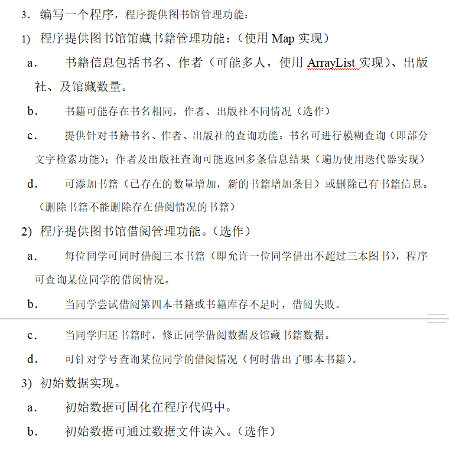
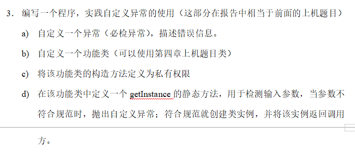
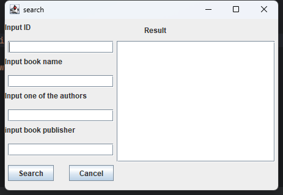
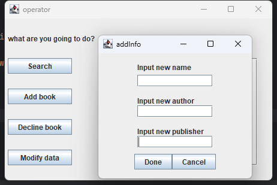
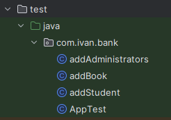

# 第五第六章上机报告（一）
本来想综合各类工具，做一个较大的项目，为大作业小组分工做准备（如果有时间做的话）。但由于时间较为紧张，就只能先实现部分功能，做出了一个半成品，望见谅。日后如果时间充裕，会继续将剩下的内容做下去，并使用数据库将先前的内容进行优化。
## 实验题目

## 题目分析
第六章的内容可以嵌入到第五章的内容中，及自定义一个Exception，用于第五章中内容的实现。
对于第五章，个人认为需要实现以下功能
    存放图书信息。如果可能存在书名相同，作者、出版社不同情况，则需要设置独一无二的id号加以区别。本来需要存放在数据库中，本次为模拟前后端传输，同时满足使用Map存放图书信息的功能，使用json存储。
    图书管理员需要进行以下功能：
        增加书籍：新增一个json文件，存放图书信息。
        删除书籍：删除一个文件，如果书籍有人借阅，则返回错误信息。
        搜索。
        改变书籍信息。
    学生需要进行以下功能：
        借阅书籍：书籍中的数量键中的值减少1，学生文件中增加书籍键中的id号。
        还书：书籍中数量键增加1，学生文件中的id号删除。
        搜索。
        查看书籍信息。
    提供注册功能，增加账户文件。
经思考，其中借书、查看、改变信息、删书可内嵌在搜索功能中。
## 设计
以上，需要设计以下内容：
    书籍写入类
    书籍读取类，由搜索类实现。
    账户抽象类，派生管理员与学生两种账户写入类。
    各种GUI页面类。
## 过程
前置内容
[GitHub的上传](https://ivanclf.github.io/2024/05/15/git-use/)
[json的使用](https://ivanclf.github.io/2024/05/15/maven-use/)
目前已实现的功能：
    基于搜索类，实现的删书、借书（书籍信息减少）、加书、搜索、显示信息功能
    使用正则表达式，实现模糊搜索功能
    GUI全部实现
    定义了一个字符串判空的**NoInputException**
    将该工程上传到了GitHub上，[点击分支，到master上](https://github.com/Ivanclf/Library-check)
未实现的功能
    还书、改变信息、注册、借书（学生账户信息增加）等功能
    **NoInputException**的功能尚不完全，达不到上机作业要求，只能“够用”，用于判断书籍被借阅的Exception还没有写
    GitHub上的main分支和master分支未合并
需要改进的地方
    搜索类的多态居然是基于switch的……虽然能让文件看起来少了一点，但导致了后面加功能的时候极其混乱，日后需要另外定义搜索的抽象类
    虽然使用了IDEA自带的GUI图形化编辑窗口，但设计GUI还是占用了大量时间，对网格包布局还是不熟悉。虽然日后应该会涉及前端3语言，但目前还是先用swing应付，设计GUI的时间需要缩短
    本工程设计文件及流的读写，由于先前并没有系统学习有关内容，导致相关操作还是比较混乱的（其实本工程也可以作为第六章作业，但和上机要求完全不搭）
## 结果
并没有完全实现，就不展现全部结果了。可以找到*libraryCheck\src\main\java\com\ivan\bank*中的App.java开始浏览（也可以直接点击快捷方式）

